# Redux

redux_analogy_code_snippet

Past code into link below:
https://codepen.io

Dependencies:
Add Redux

Settings -> JavaScript Tab -> Under 'Add External Scripts/Pens' -> Search for 'Redux' and add the library.

-----------

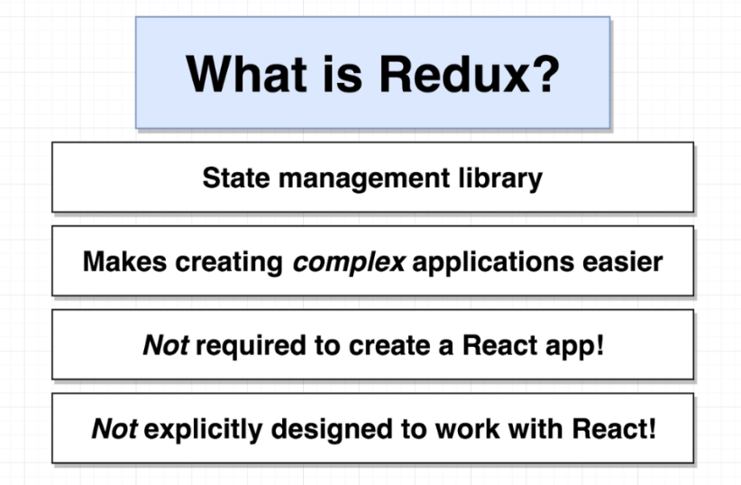

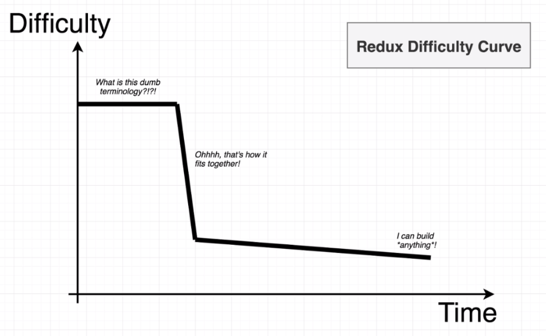

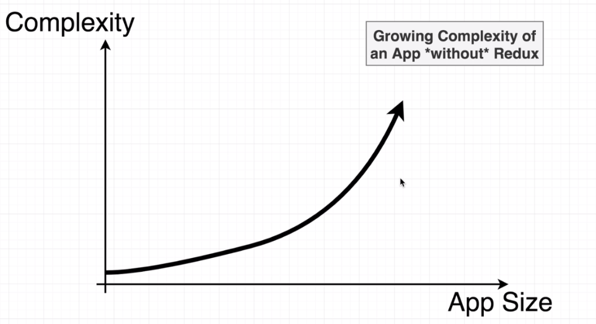

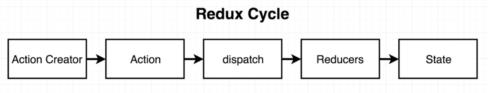

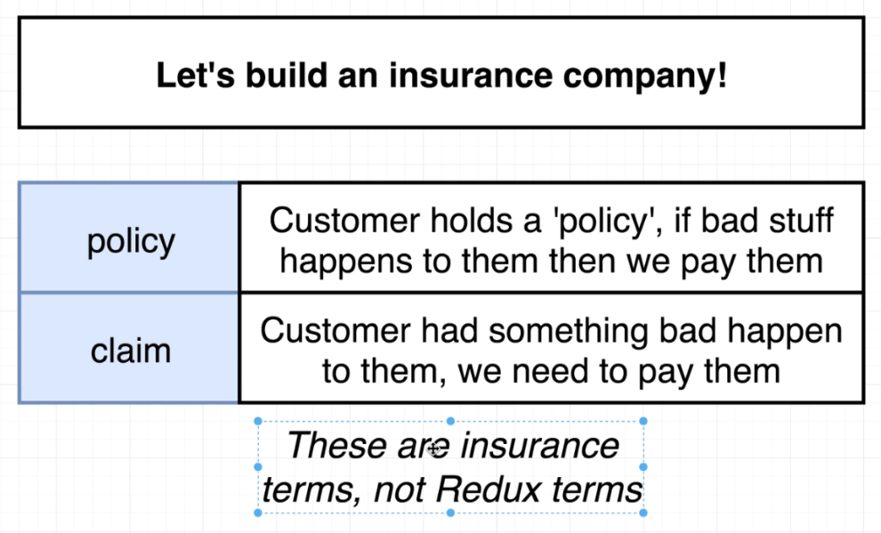

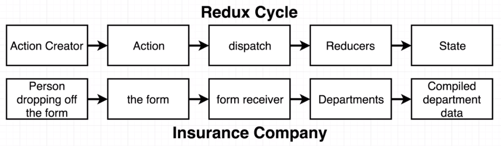

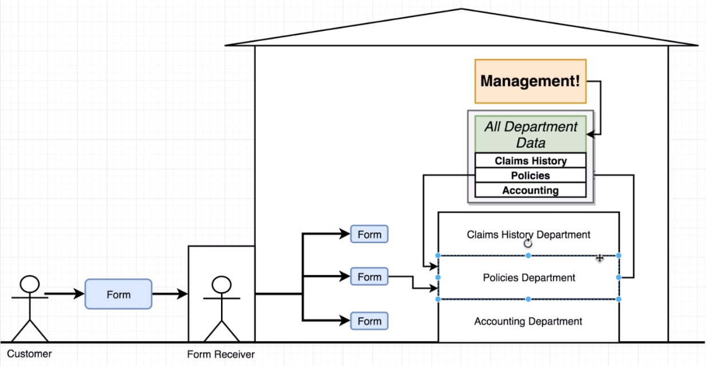

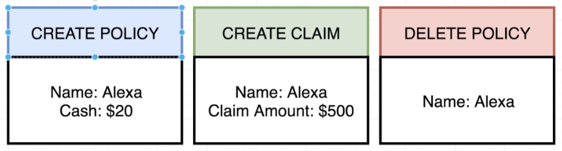

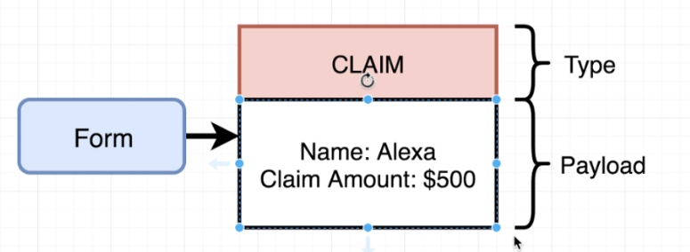

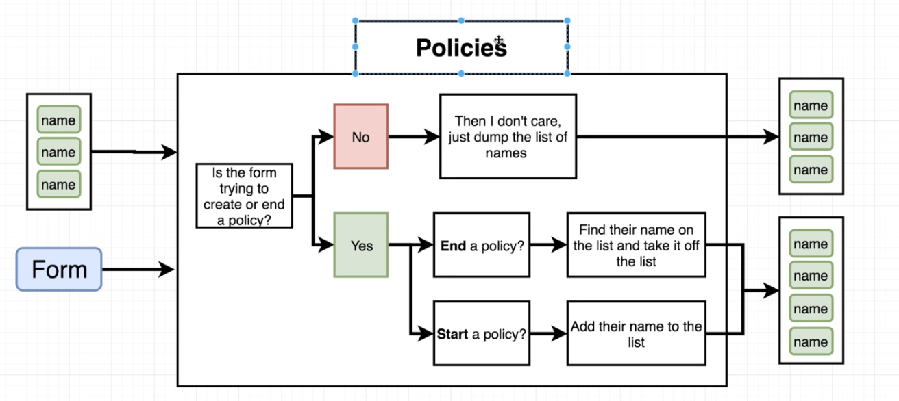

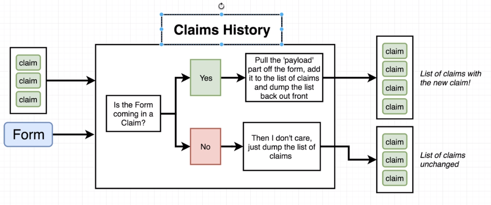

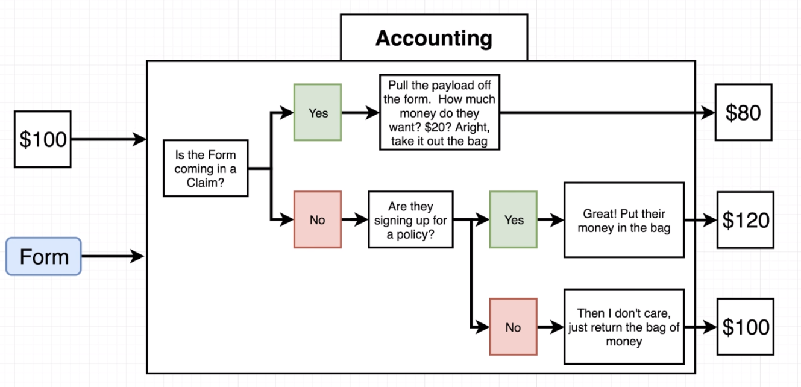

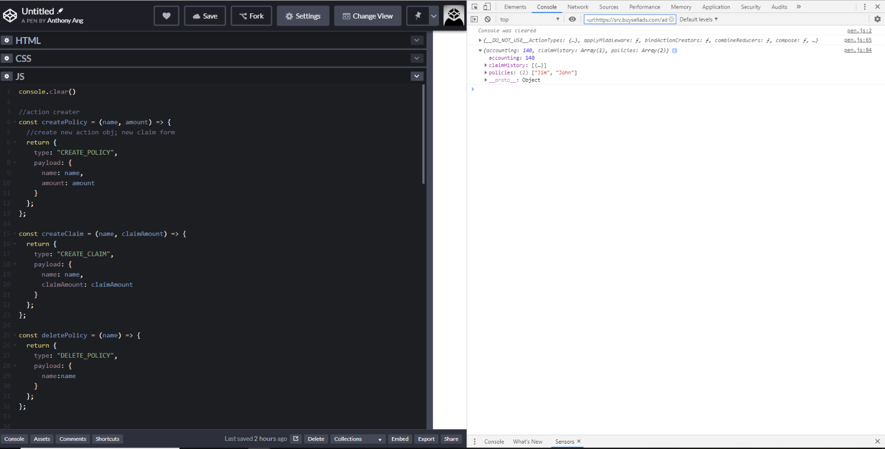

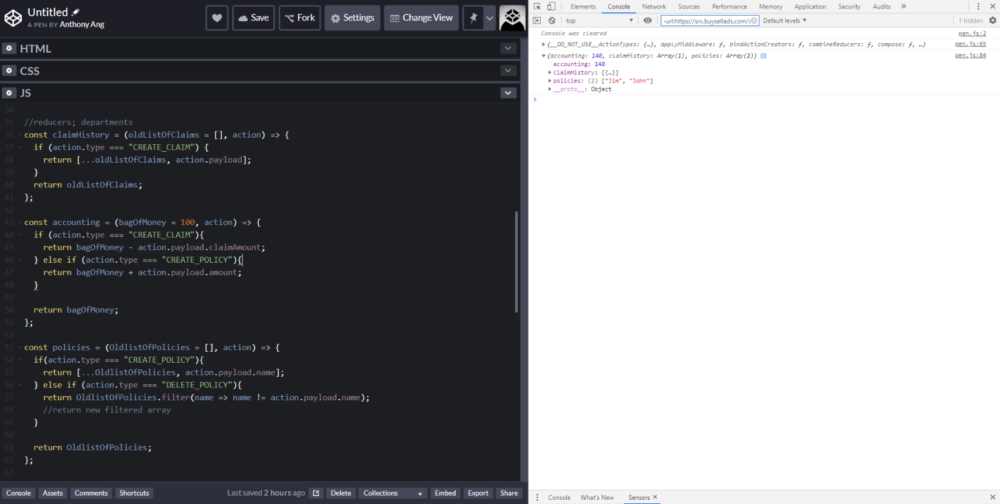

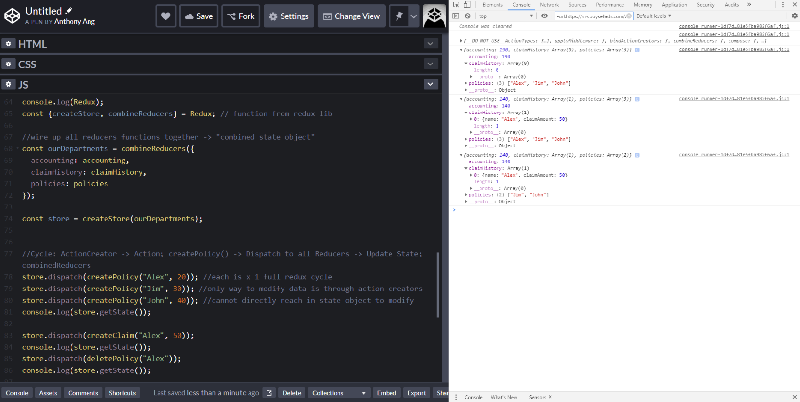

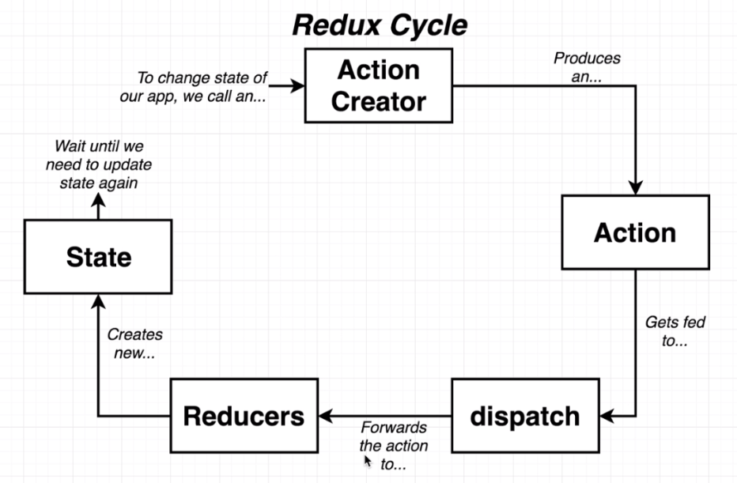

